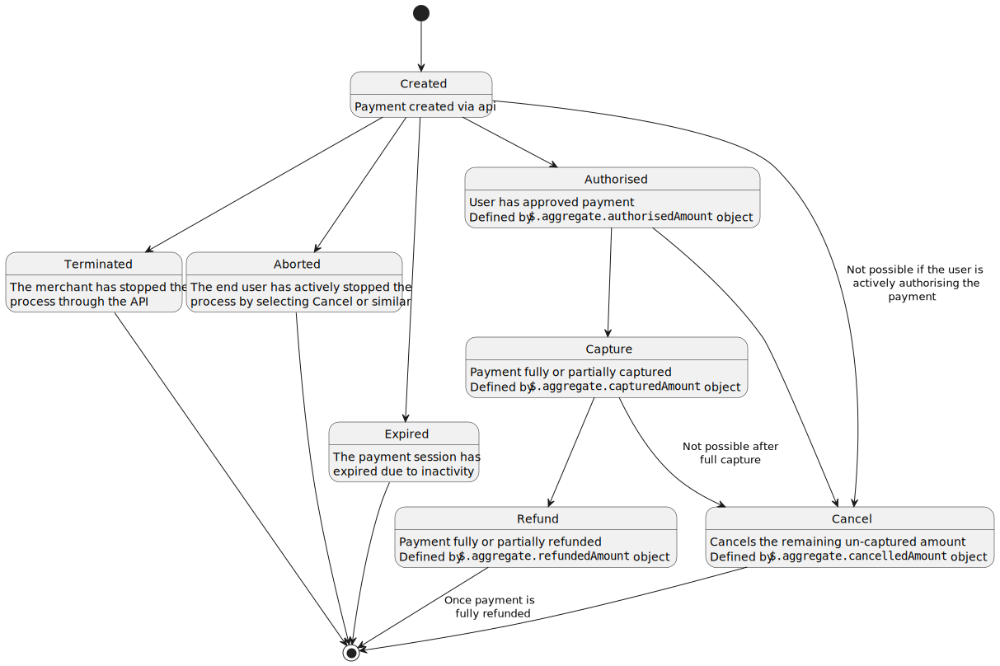

# Payment Modification

Once a payment is `CREATED`, several modification actions can be made. Modification actions are defined as separate endpoints in the api. These are:

The following flow diagram describes when each modification action is applicable.
