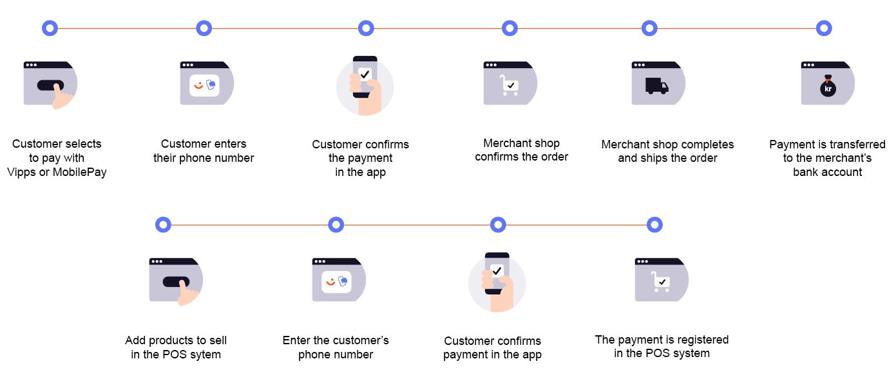

# ePayment API

The ePayment API enables your customers to pay with Vipps MobilePay from online shops; as well as at the Point Of Sale (POS).

## History

The ePayment API is the new version of both the
[eCom API](https://developer.vippsmobilepay.com/docs/APIs/ecom-api) and the
[MobilePay App Payments API](https://developer.mobilepay.dk/docs/app-payments).
It is based on everything we have learned through those APIs over several years.

This API contains new functionality, so you should
[migrate to the ePayment API](https://developer.vippsmobilepay.com/docs/APIs/epayment-api/migration/)
as soon as possible to take advantage of the improved user experience.

## User flows

The ePayment API supports several user flows and can be used for any type of payment situation:

* Payments online (remote sales)
* Payments in physical situations (when the customer is present)
* Payments initiated on the customer's phone, or on a different device (including the merchant's device)
* Payments using QR codes
* etc

See
[Create payment](https://developer.vippsmobilepay.com/docs/APIs/epayment-api/operations/create/)
for details.

## Features

The features of the ePayment API include:

* [Profile sharing](https://developer.vippsmobilepay.com/docs/APIs/epayment-api/features/profile-sharing)
* [Long-Living payments](https://developer.vippsmobilepay.com/docs/APIs/epayment-api/features/long-living-payments)
* [Freestanding card payments](https://developer.vippsmobilepay.com/docs/APIs/epayment-api/features/free-standing-card-payments)
* [QR payments](https://developer.vippsmobilepay.com/docs/APIs/epayment-api/features/qr-payments)
* [Webhooks](https://developer.vippsmobilepay.com/docs/APIs/epayment-api/features/webhooks)

The ePayment API enables merchants to accept payments using both the app and cards without the app:

* [App](how-it-works/vipps-epayment-api-how-it-works-online.md#1-pay-with-vipps)
* [Credit and debit cards](features/free-standing-card-payments.md)

## How it works

* [ePayment API: How It Works online](./how-it-works/vipps-epayment-api-how-it-works-online.md):
  Enable your customers to pay with Vipps MobilePay online or in your app.
* [ePayment API: How it works in the store](./how-it-works/vipps-epayment-api-how-it-works-in-store.md):
  How the ePayment API can be integrated in your Point Of Sale (POS) system.

## Next steps

See
[Vipps MobilePay getting started](https://developer.vippsmobilepay.com/docs/vipps-developers/getting-started)
for information about API keys, product activation, how to make API calls, etc.

Review the detailed documentation found here:

* [API quick start](quick-start.md): Quick start guide.
* [API features](features/README.md): Developer guide for the ePayment API.
* [API checklist](checklist.md): For direct and POS integrations.
* [API spec](https://developer.vippsmobilepay.com/api/epayment): ePayment API reference specifications.
