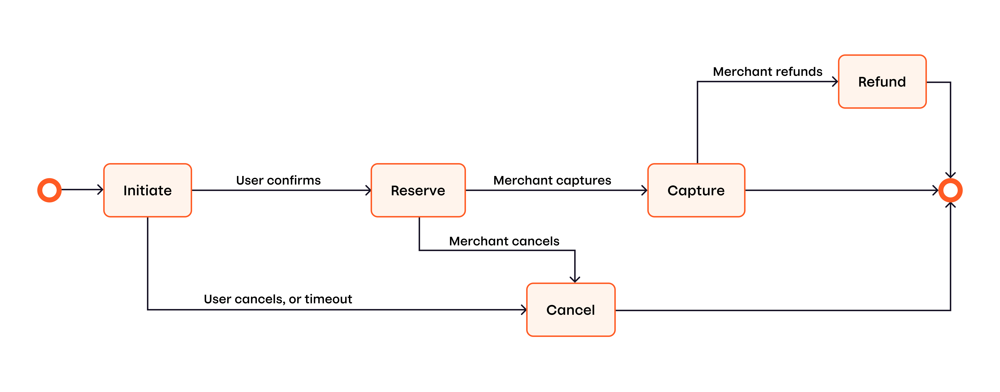

<!-- START_METADATA
---
title: tmp file
draft: true
---
END_METADATA -->

# Old ecom Guide

The Vipps eCom API is used by
[Vipps på nett (*Vipps Online*)](https://vipps.no/produkter-og-tjenester/bedrift/ta-betalt-paa-nett/ta-betalt-paa-nett/),
[Vipps Checkout](https://vipps.no/produkter-og-tjenester/bedrift/ta-betalt-paa-nett/vipps-checkout/),
[Vipps i kassa (*Vipps in Store*)](https://vipps.no/produkter-og-tjenester/bedrift/ta-betalt-i-butikk/vipps-i-kassa/),
native apps and other solutions.

API version: 1.0.0.

<!-- START_COMMENT -->

ℹ️ Please use the new documentation:
[Vipps Technical Documentation](https://vippsas.github.io/vipps-developer-docs/).

## Table of contents

- [Payment flows](#payment-flows)
- [Quick start](#quick-start)
- [API endpoints](#api-endpoints)   
- [Authentication](#authentication)
- [Vipps HTTP headers](#vipps-http-headers)
- [Initiate](#initiate)
  - [Regular payments and express payments](#regular-payments-and-express-payments)
  - [Regular eCommerce payments](#regular-ecommerce-payments)
  - [Express checkout payments](#express-checkout-payments)
 - [Old and new express checkout flow](#old-and-new-express-checkout-flow)
 - [How to specify the old or new express checkout flow](#how-to-specify-the-old-or-new-express-checkout-flow)
 - [Shipping and static shipping details](#shipping-and-static-shipping-details)
 - [Consent and GDPR](#consent-and-gdpr)
  - [Phone and mobile browser flow](#phone-and-mobile-browser-flow)
 - [Vipps installed](#vipps-installed)
 - [Vipps not installed](#vipps-not-installed)
  - [Desktop flow](#desktop-flow)
  - [Payments initiated in an app](#payments-initiated-in-an-app)
  - [Initiate payment flow: API calls](#initiate-payment-flow-api-calls)
  - [The Vipps deeplink URL](#the-vipps-deeplink-url)
 - [isApp](#isapp)
  - [Payment identification](#payment-identification)
  - [Payment retries](#payment-retries)
  - [OrderId recommendations](#orderid-recommendations)
  - [transactionText recommendations](#transactiontext-recommendations)
  - [URL Validation](#url-validation)
- [Callbacks](#callbacks)
  - [Callback URLs](#callback-urls)
  - [Callback examples](#callback-examples)
  - [How to test your own callbacks](#how-to-test-your-own-callbacks)
  - [Authorization for callbacks](#authorization-for-callbacks)
  - [Vipps callback servers](#vipps-callback-servers)
  - [Callback statuses](#callback-statuses)
- [Timeouts](#timeouts)
- [The Vipps landing page](#the-vipps-landing-page)
- [Reserve](#reserve)
- [Capture](#capture)
- [Cancel](#cancel)
  - [Cancelling a pending order](#cancelling-a-pending-order)
  - [Cancelling a partially captured order](#cancelling-a-partially-captured-order)
- [Refund](#refund)
- [Get payment details](#get-payment-details)
  - [Payment states](#payment-states)
  - [Requests and responses](#requests-and-responses)
  - [Example response](#example-response)
  - [Polling guidelines](#polling-guidelines)
- [Get payment status](#get-payment-status)
- [Userinfo](#userinfo)
  - [Scope](#scope)
  - [Userinfo call-by-call guide](#userinfo-call-by-call-guide)
  - [Get userinfo](#get-userinfo)
  - [Userinfo call](#userinfo-call)
  - [Consent](#consent)
- [HTTP response codes](#http-response-codes)
- [Rate limiting](#rate-limiting)
- [Partner keys](#partner-keys)
- [Idempotency](#idempotency)
- [Exception handling](#exception-handling)
  - [Connection timeout](#connection-timeout)
  - [Callback aborted or interrupted](#callback-aborted-or-interrupted)
  - [Clean-up strategies](#clean-up-strategies)
  - [Recommendations for handling very high traffic](#recommendations-for-handling-very-high-traffic)
- [App integration](#app-integration)
- [Errors](#errors)
- [Testing](#testing)
- [Recommendations regarding handling redirects](#recommendations-regarding-handling-redirects)
- [Questions?](#questions)

<!-- END_COMMENT -->

## Payment flows

There are many ways to use the Vipps eCom API. For example:

* *Vipps Online* - The customer selects Vipps as the method
  of payment and the merchant creates a payment session. The customer reviews
  the payment in the Vipps app and confirms the purchase. If the purchase is 
  approved, the merchant registers the sale in their system. See
  [Vipps ePayments API: How It Works](vipps-epayments-api-howitworks.md) for more information.
* *Vipps Checkout* - The same as *Vipps Online* except that, instead of
  confirming the purchase in the Vipps app, the customer consents to sharing
  their personal information (e.g., address, phone, and payment information).
  They then complete the purchase from the website where their information is
  automatically pre-filled.
* *Vipps In Store* - The same as *Vipps Online* except that
  the phone number is provided to the service provider who then initiates the
  payment through their Point of Sale (POS) system. See
  [Vipps in store](vipps-in-store-image.pnghowitworks.md) for more information. !!TODO FIX!!

This diagram shows a simplified payment flow:

See [Get payment details](#get-payment-details) for more information about
the detailed flow and [Payment states](#payment-states) for the corresponding
states.

The flow of settlements and how to retrieve them are described in
[Settlements](https://vippsas.github.io/vipps-developer-docs/docs/vipps-developers/settlements).

## Quick start

The normal "happy day" flow for a payment is documented in the
[Getting guide](../getting-started.md).

This API guide is extensive: We have done our best to document everything about
this API, and you *should* have all information needed to integrate with Vipps.

## API endpoints

The Vipps eCommerce API (eCom API) offers functionality for online payments.
Payments are supported in both web browsers and in native apps (via deep-linking).

Operation|Description| Endpoint
:--- |:--- |:--- |
[Initiate payment](create-payment.md) | Payment sessions creation, the first **request** in the payment flow.| [`POST:/epayment/v1/payments`](https://vippsas.github.io/vipps-developer-docs/api/epayment#tag/CreatePayments/operation/createPayment)
[Get payment](./queries/get-payment.md) | The current details of the payment.  | [`GET:/epayment/v1/payments/{reference}`](https://vippsas.github.io/vipps-developer-docs/api/epayment#tag/QueryPayments/operation/getPayment)
[Get payment event log](./queries/get-payment-event-log.md) | The full history of event on the payment.  | [`GET:/epayment/v1/payments/{reference}/events`](https://vippsas.github.io/vipps-developer-docs/api/epayment#tag/QueryPayments/operation/getPaymentEventLog)
[Capture payment](modifications/capture.md) | When an amount has been reserved, and the goods are (about to be) shipped, the payment must be *captured*. | [`POST:/epayment/v1/payments/{reference}/capture`](https://vippsas.github.io/vipps-developer-docs/api/ecom#tag/Vipps-eCom-API/operation/capturePaymentUsingPOST)
[Cancel payment](modifications/cancel.md) | The merchant may release reserved funds back to the consumer by cancelling the payment | [`PUT:/epayment/v1/payments/{reference}/cancel`](https://vippsas.github.io/vipps-developer-docs/api/ecom#tag/Vipps-eCom-API/operation/cancelPaymentRequestUsingPUT)
[Refund payment](modifications/refund.md) | The merchant may refund a captured amount. | [`POST:/epayment/v1/payments/{reference}/refund`](https://vippsas.github.io/vipps-developer-docs/api/ecom#tag/Vipps-eCom-API/operation/refundPaymentUsingPOST)
[Access Token](https://vippsas.github.io/vipps-developer-docs/docs/vipps-developers/vipps-getting-started#get-an-access-token) | Fetch the access token | [`POST:/accesstoken/get`](https://vippsas.github.io/vipps-developer-docs/api/access-token#tag/Authorization-Service/operation/fetchAuthorizationTokenUsingPost)

See the
[ePayment API checklist](../vipps-epayment-api-checklist.md).

## Vipps HTTP headers

We recommend using the standard Vipps HTTP headers for all requests.

See [Vipps HTTP headers](https://vippsas.github.io/vipps-developer-docs/docs/vipps-developers/common-topics/http-headers)
in the Common topics guide, for details.

## Authentication

All Vipps API calls are authenticated with an access token and an API subscription key.
See
[Get an access token](https://vippsas.github.io/vipps-developer-docs/docs/vipps-developers/vipps-getting-started#get-an-access-token)
in the Getting started guide, for details.
