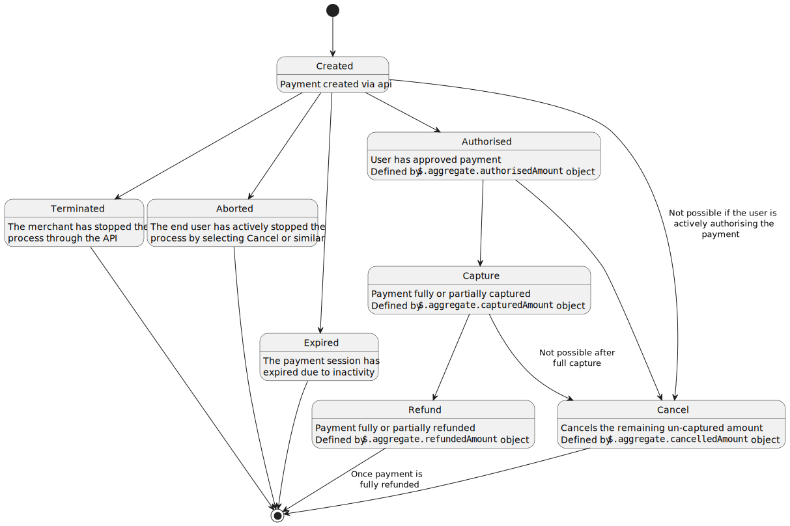

<!-- START_METADATA
---
title: Payment States
id: payment-states
pagination_prev: APIs/epayment-api/api-guide/getting-started
pagination_next: APIs/epayment-api/api-guide/modifications/capture
sidebar_label: Modifications
sidebar_position: 30
---
END_METADATA -->

# Payment session states

Once a payment is `CREATED`, several modification actions can be made. Modification actions are defined as separate endpoints in the api. These are:

The following flow diagram describes when each modification action is applicable.

## Modifications

* [Capturing a payment](capture.md)
* [Canceling a payment](cancel.md)
* [Refunding a payment](refund.md)