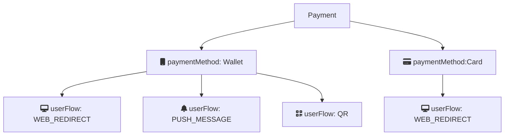

<!-- START_METADATA
---
title: Create payment
sidebar_label: Create payment
hide_table_of_contents: true
pagination_next: null
pagination_prev: null
sidebar_position: 20
---
END_METADATA -->

# Create payment

The first step in the payment flow is creating a payment by calling [CreatePayment](https://vippsas.github.io/vipps-developer-docs/api/epayment#tag/CreatePayments) endpoint. This endpoint supports card and wallet as payment methods and different user flows for each.

`paymentMethod.type` in the request determines the type of payment. Allowed values are `CARD` and `WALLET`

## User flow alternatives

### WEB_REDIRECT

Default flow for:

- wallet payments
    - Opening the Vipps Landing Page on desktop, and automatic redirect to Vipps on mobile devices. More information at [Vipps landing page](https://vippsas.github.io/vipps-developer-docs/docs/vipps-developers/common-topics/vipps-landing-page)
- card payments
    - Opening the Vipps card entry page on both desktop/mobile. More information at [Card payments](https://vippsas.github.io/vipps-developer-docs/docs/APIs/checkout-api/vipps-checkout-api-faq#card-payments)

### PUSH_MESSAGE

Applicable only for Wallet payments. This will skip the Vipps landing page and is only allowed if user is not starting the payment from own device (e.g., from a Point Of Sale device, automates and similar). 
If userFlow is `PUSH_MESSAGE`, a valid value for `$.customer.phoneNumber` is required.

### QR

Applicable only for Wallet payments. For customer facing screens where payment can be initiated with [Vipps One Time Payment QR](https://vippsas.github.io/vipps-developer-docs/docs/APIs/qr-api/vipps-qr-one-time-payment-api-howitworks).