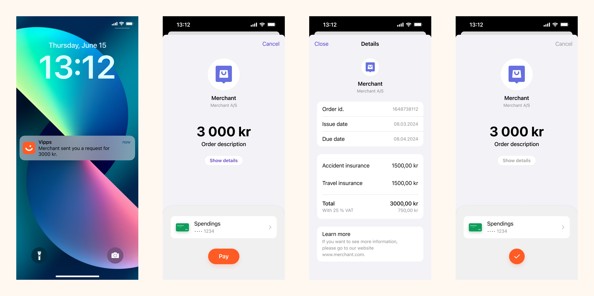
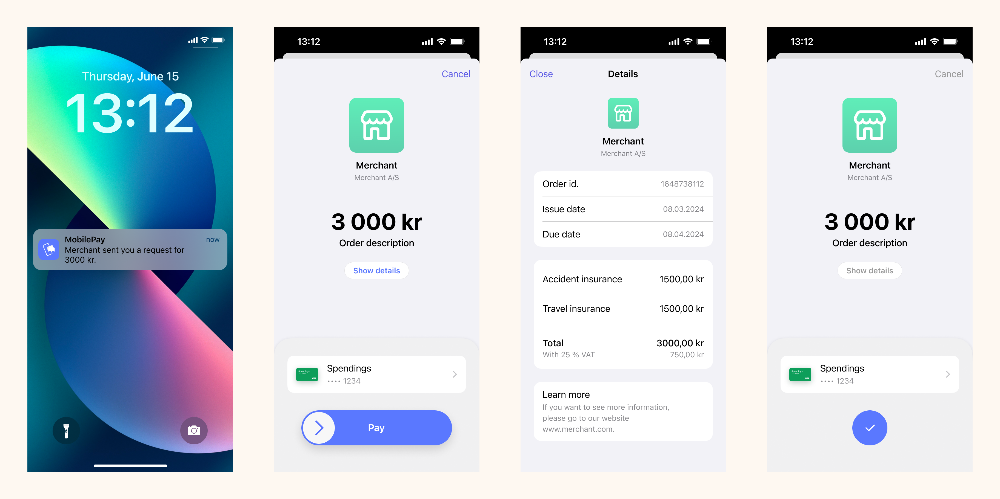
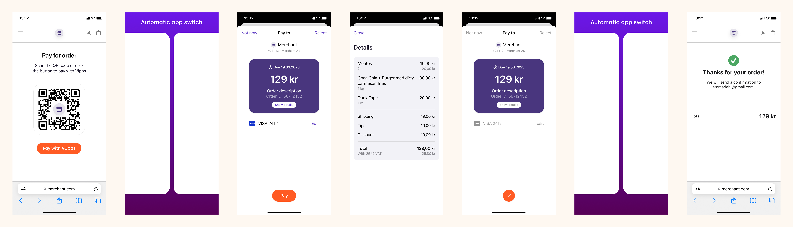
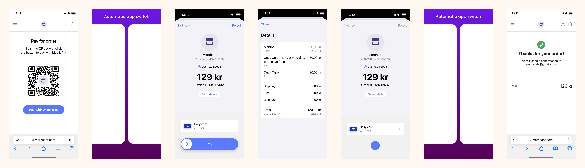
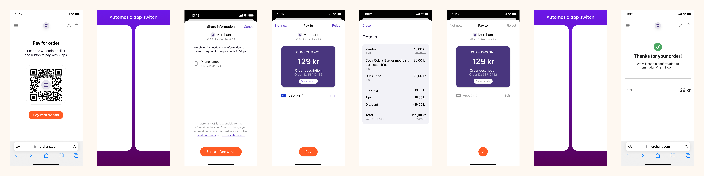
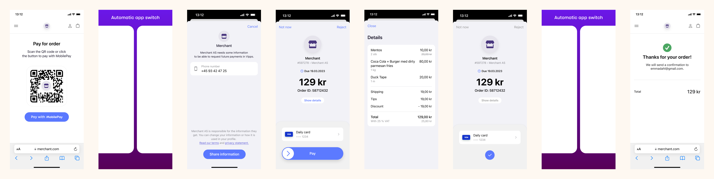

import ApiSchema from '@theme/ApiSchema';
import Tabs from '@theme/Tabs';
import TabItem from '@theme/TabItem';

# Long-living payments

 *Available for Vipps.*

 *Available for MobilePay in selected markets at the [Vipps MobilePay joint platform launch](https://www.vippsmobilepay.com/#about).*

💥 *Please note: In Q4 2023, we will additionally send a push notification to the user when the payment is getting close to expiring.* 💥

The ePayment API supports long-living payments where the merchant
can specify the expiration time when initiating the payment with
[`POST:/epayment/v1/payments`](https://developer.vippsmobilepay.com/api/epayment#tag/CreatePayments).

This is done by specifying `expiresAt` in the payment initiation request.
The `expiresAt` must be between 10 minutes and 28 days (40320 minutes) in the future.

**Please note:** This functionality is only available when using the `WALLET` payment method,
since the app is required (it does not work with
[freestanding card payments](https://developer.vippsmobilepay.com/docs/APIs/epayment-api/features/free-standing-card-payments/)).

**Please note:** Sales units (i.e., Merchant Serial Numbers) must be especially approved to use this feature.
The user experience, including the standard timeout, should be as
consistent as possible, so this should only be used in special cases.
To request this feature, please contact your key account manager, your partner manager, or
[customer service](https://vipps.no/kontakt-oss/).

## Request

```json
{
   "amount":{
      "currency":"NOK",
      "value":49900
   },
   "customer":{
      "phoneNumber":4791234567
   },
   "paymentMethod":{
      "type":"WALLET"
   },
   "reference":"acme-shop-123-order123abc",
   "returnUrl":"https://example.com/redirect?reference=acme-shop-123-order123abc",
   "userFlow":"PUSH_MESSAGE",
   "expiresAt":"2023-02-15T00:00:00Z"
}
```

This will send a push message to the customer's app (specified with `phoneNumber`),
and the customer confirms the payment.

If the customer's phone number is unknown, the request can specify `userFlow` as `QR`.
This will return the QR code for a payment, including the expiration time specified.
The customer scans the QR code to complete the payment flow in the app.

If a payment is initiated with the `expiresAt` for a sales unit that is not allowed to use
the feature, the response will be an error.

## Response

The response is similar to a regular payment initiation.

# Payment Requests

Use Vipps MobilePay to make *long living payment requests* for your customers by using the `"expiresAt"` feature. This will create payment requests that can be seen and postponed by the user, up to 28 days. Note: The APIs are ready, but it is not testable before app updates planned summer 2023.

The following sections will explain how to implement this feature for a couple scenarios:

## Scenario 1. Payment request sent directly to app

If you have the customer's phone number and their consent to send payment requests through Vipps MobilePay, you can send payment requests directly to the customer.

The flow for the customer will look like this:

<Tabs
defaultValue="vipps"
groupId="app-choice"
values={[
{label: 'Vipps', value: 'vipps'},
{label: 'MobilePay', value: 'mobilepay'},
]}>
<TabItem value="vipps">



</TabItem>
<TabItem value="mobilepay">



</TabItem>
</Tabs>

1. To create this payment, you first need to make a [create payment](https://developer.vippsmobilepay.com/api/epayment#tag/CreatePayments) request where `customer.phoneNumber` is set.
2. The customer will receive a push notification in their Vipps or MobilePay app.
3. When the customer selects `See details` in the payment confirmation screen, they are presented with the order information provided by the merchant without leaving the Vipps or MobilePay app.
4. The customer approves the payment.

   Users also have the option of soft-dismissing the payment and postponing it for later.

## Scenario 2. Payment request as a link

Even if you don't know your customer's phone number, you can start a payment request by sending them a link to your own landing page. This, in turn, can trigger a payment request through the API.

The flow for the customer will look like this:

<Tabs
defaultValue="vipps"
groupId="app-choice"
values={[
{label: 'Vipps', value: 'vipps'},
{label: 'MobilePay', value: 'mobilepay'},
]}>
<TabItem value="vipps">



</TabItem>
<TabItem value="mobilepay">



</TabItem>
</Tabs>

1. In your website, mobile app, on paper document or email you send, provide your customers with an option for opting-in to receive payment request for payment requests in the Vipps or MobilePay app.
2. Present them with the *Pay with Vipps* or *Pay with MobilePay* option.
3. Send the [create payment](https://developer.vippsmobilepay.com/api/epayment#tag/CreatePayments) request.

4. If the customer is on a desktop computer, the
   [Landing page](https://developer.vippsmobilepay.com/docs/common-topics/landing-page/)
   opens. If on a mobile device, the Vipps or MobilePay app opens automatically.

## Scenario 3. Payment request with sharing of telephone number

The flow for the customer will look like this:

<Tabs
defaultValue="vipps"
groupId="app-choice"
values={[
{label: 'Vipps', value: 'vipps'},
{label: 'MobilePay', value: 'mobilepay'},
]}>
<TabItem value="vipps">



</TabItem>
<TabItem value="mobilepay">



</TabItem>
</Tabs>

This is very similar as [scenario 2](#scenario-2-payment-request-as-a-link).
The difference is that you will also ask the user to share their telephone number.
This is done by setting the `scope` parameter with a value of `phoneNumber` in the
[create payment](https://developer.vippsmobilepay.com/api/epayment#tag/CreatePayments) request.

After the user have finished the payment, you will get the phone number of the customer. This means you can proceed with scenario 1 in the future and send the payment request directly to the customer. There is more info about fetching user data in the
[profile sharing](https://developer.vippsmobilepay.com/docs/APIs/epayment-api/features/profile-sharing/)
section.

## General create request example

Example body:

   ```json
   {
      "amount":{
         "currency":"NOK",
         "value":6000
      },
      "customer":{
         "phoneNumber":4791234567
      },
      "paymentMethod":{
         "type":"WALLET"
      },
      "receipt":{
         "orderLines": [
            {
               "name": "Socks",
               "id": "line_item_1",
               "totalAmount": 1000,
               "totalAmountExcludingTax": 800,
               "totalTaxAmount": 200,
               "taxPercentage": 25,
               "unitInfo": {
               "unitPrice": 400,
               "quantity": "2.5",
               "quantityUnit": "KG"
               },
               "discount": 0,
               "productUrl": "https://example.com/store/socks",
               "isReturn": false,
               "isShipping": false
            },
            {
               "name": "Flip-flops",
               "id": "line_item_2",
               "totalAmount": 5000,
               "totalAmountExcludingTax": 4000,
               "totalTaxAmount": 1000,
               "taxPercentage": 25,
               "unitInfo": {
               "unitPrice": 2500,
               "quantity": "3",
               "quantityUnit": "PCS"
               },
               "discount": 2500,
               "productUrl": "https://example.com/store/flipflops",
               "isReturn": false,
               "isShipping": false
            }
         ],
         "bottomLine": {
            "currency": "NOK",
            "tipAmount": 0,
            "posId": "pos_122",
            "paymentSources": {
               "giftCard": 0,
               "card": 0,
               "voucher": 0,
               "cash": 0
            },
            "barcode": {
               "format": "CODE 39",
               "data": "SC0527013501 "
            },
            "receiptNumber": "0527013501"
         }
      },
      "reference":"acme-shop-123-order123abc",
      "paymentDescription": "Invoice# 424243, due date: 01 Jan 2025",
      "returnUrl":"https://example.com/redirect?orderId=1512202",
      "userFlow":"PUSH_MESSAGE",
      "expiresAt":"2023-09-15T00:00:00Z"
   }
   ```

To create a *payment request*, the following parameters can/must be used, depending on the scenario:

* `reference` - The `orderId` of the payment request.
* `expiresAt` - The expiration date for the payment. This is what separates the long living payment request from a regular payment.
* `userFlow`  - Must be `"PUSH_MESSAGE"` or `"QR"`.
* `paymentDescription` - Short description with relevant information about the payment request.
* `receipt.orderLines` Order lines for the payment. The orderlines are the same as referenced in the [Order Management](https://developer.vippsmobilepay.com/docs/APIs/order-management-api/vipps-order-management-api/#adding-a-receipt) API. This **must** be present.
* `customer.phoneNumber` - The customer's phone number. This is optional, and will be used if the users phone number is known in advance.
* `scope` - This can be used to request the user to share their telephone number.
