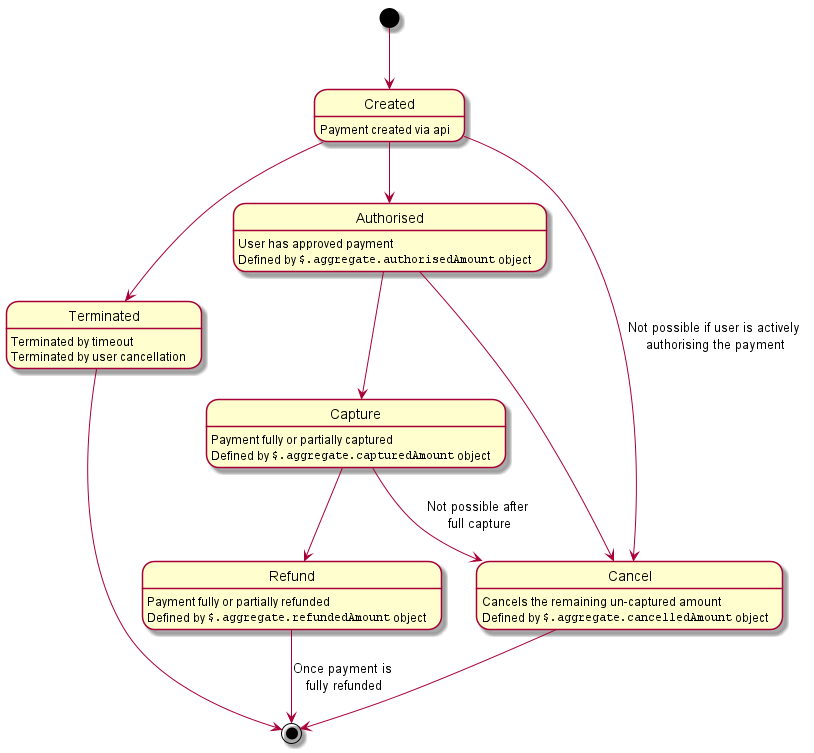

<!-- START_METADATA
---
title: Payment Modification
sidebar_position: 120
---
END_METADATA -->
# Payment Modification

Once a payment is `CREATED`, several modification actions can be made. Modification actions are defined as separate endpoints in the api. These are:

* [Cancel](#cancel)
* [Capture](#capture)
* [Refund](#refund)
* [Adjust Authorisation](#adjust-authorisation)

The following flow diagram describes when each modification action is applicable.

## Modification Actions

All modification actions are asynchronous. If the payment action is possible according to business rules a `202 Accepted` response will be issued to the API request. The result of the modification will then be posted over the [Notifications Service](./How-to-setup-Notification-Webhooks.md). This result will also be available on the [Events](https://vippsas.github.io/vipps-developer-docs/docs/APIs/epayments-api/) API endpoint once processed.

### Cancel

If you no longer wish to initiate settlement of the remaining funds on a payment then you should [Cancel](https://vippsas.github.io/vipps-developer-docs/docs/APIs/epayments-api/) the payment. Cancelling a payment provides a good user experience and synchronises the users bank statement and Vipps payment overview with their expectations from a merchant.

A payment can be cancelled via the api at any point until the payment is fully captured. A cancellation will release any remaining authorised funds on the customers bank account. This cancellation by the merchant via the api will result in `TERMINATED` state of the payment.

A cancel can also be performed before an authorisation if required. A cancel by the end user before `AUTHORISATION` will result in a `ABORTED` state of the payment.

> Note: It is not possible to cancel a payment while a user is actively authorising the payment. Eg: The payment is under processing with the payment scheme, or the user is in a 3DSecure session.

### Capture

When a payment is initiated with `$.directCapture = false` you must [Capture](https://vippsas.github.io/vipps-developer-docs/docs/APIs/epayments-api/) a payment in order to initiate settlement of the authorised funds.

Captured funds will be settled to the merchants settlement account after two business days, see [Settlement Information](https://vippsas.github.io/vipps-developer-docs/docs/APIs/epayments-api/) for more details.

A capture can be made in full, or partially if desired. The capture amount must be defined in capture API request.

### Refund

A [Refund ](https://vippsas.github.io/vipps-developer-docs/docs/APIs/epayments-api/) will reverse the direction of a transaction and move money from the Merchant back to the customer.

Refunds can be made in full or partially as needed. The refund amount must be defined in the refund API request.

### Adjust Authorisation

To be provided.