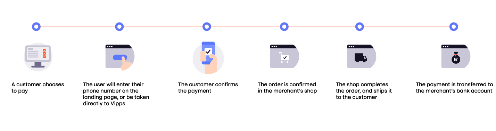
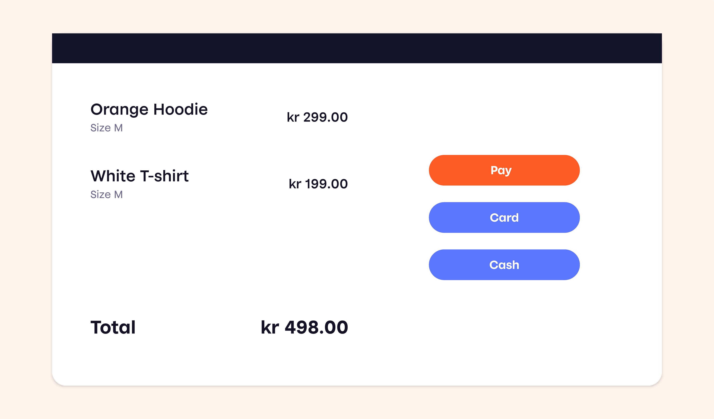
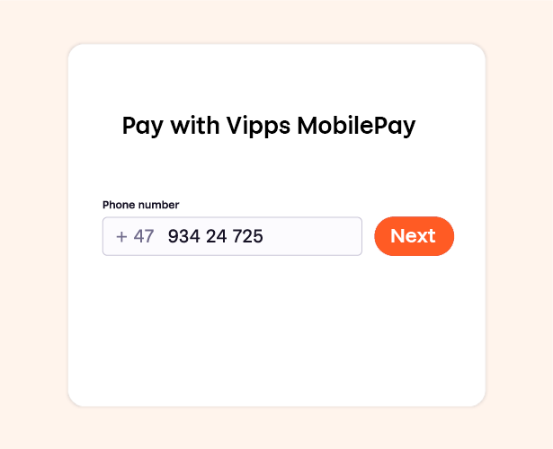
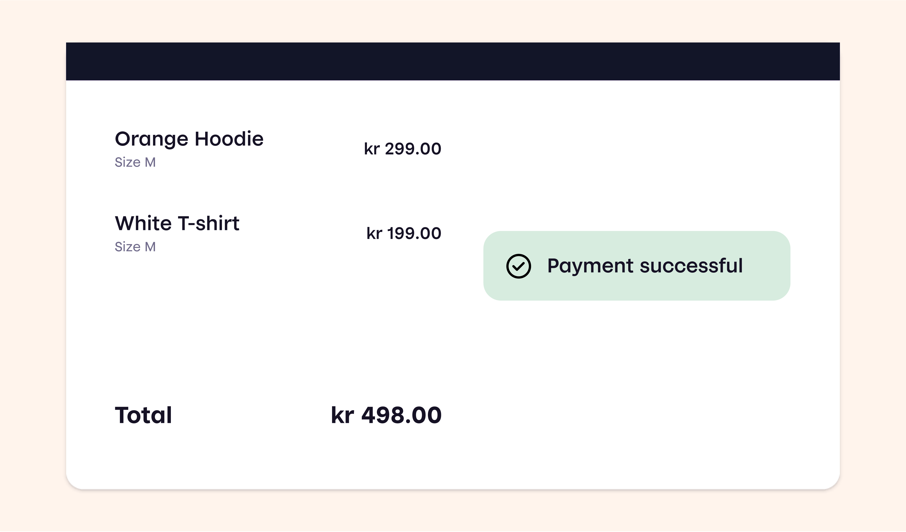

# How ePayment works in the store

Enable your customers to pay easily and quickly from their own phone, without the need to touch the terminal.
Offer contactless payment to your customers by integrating the ePayment API into your POS system.

It is also possible to use our simpler solution, *Vipps number*, but then the amount must be entered manually at checkout, and there will be some follow-up with accounting and settlement.

## 1. Add products to sell

Add the products that the customer wants to buy in the POS system.

## 2. Enter the customer's phone number

When the customer is ready to pay, choose *Pay with Vipps* or *Pay with MobilePay*, as applicable.
Enter the customer's phone number.

## 3. The customer confirms payment in the app

The customer confirms the payment in  their Vipps MobilePay app.

## 4. Register the payment

Register the payment in your POS system.

