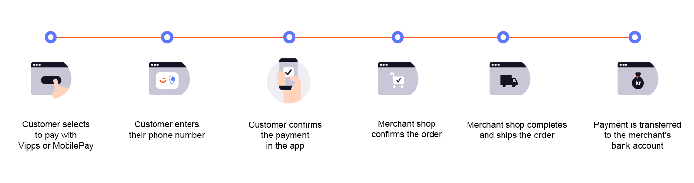

# How ePayment works online

This is how payments in web shops or merchant websites work with the ePayment API.

## Details

### 1. Customer selects their payment method

On the product page of a merchant's website or app, the customer chooses to pay with Vipps or MobilePay.
They can alternatively select to pay with a card.
See [Alternative flow: Pay with by card](#alternative-flow-pay-with-by-card) for details.

### 2. Customer enters their phone number and logs in

If the payment was started from a mobile device, the Vipps or MobilePay app will automatically open.

If the payment was started on a desktop device, the
[landing page](https://developer.vippsmobilepay.com/docs/common-topics/landing-page/)
will open. There, the customer confirms their number and logs in to Vipps MobilePay.

### 3. Customer confirms the payment in the app

A push notification appears on the customer's phone. They log in to Vipps MobilePay and confirm the payment.
The ePayment API automatically reserves the payment and provides a receipt of the successful payment.

### 4. The merchant's shop confirms the order

The store page or app opens again and confirms that the order was successful.

### 5 The merchant completes the order and shipping

The merchant completes the order and ships it to the customer.

### 6. Capture the payment

The merchant captures the order through the ePayment API.
The payment is transferred to the merchant's account. This may take 2-3 days depending on your bank.

## Alternative flow: Pay with by card

Customers can choose to pay with card by selecting *Card* on the product page of a merchant's website or app.

The card entry page opens, where they enter their card details.

On successful payment, the merchant's store page opens, and the order is confirmed.
