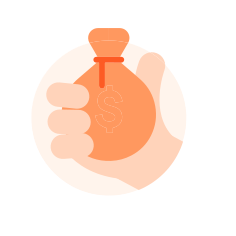

# How ePayment works online

This is how payment in webshops or merchant websites work with epayment API.

## The ecommerce payment process for Vipps users

## 1. Pay with Vipps

The user chooses “Pay with Vipps”, on the product page of a merchant’s website or app.

## 2. The Vipps landing page (If customer started on desktop)

If the payment was started on a desktop device the user will be sent to the Vipps landing page.
The user confirms their number, and is prompted to log in to Vipps.

If the payment was started from a mobile device, the app wil automatically switch over to Vipps.

## 3. Confirm payment in Vipps

The user receives a push notification on their phone. They log in to Vipps, and confirm the payment. The payment is reserved and the user gets a receipt of the successful payment

## 4. Order Confirmation

The user is redirected back to the merchant’s store, and the order is confirmed.

## 5. Completing the order and shipping

The merchant completes the order, and ships the order to the customer.

## 6. Money in the bank

The payment is transferred to the merchant’s account. This may take 2-3 days depending on your bank.

## Pay with Credit/Debit cards

If the users do not have Vipps profile or choose to pay with card they can select “Card” on the product page of a merchant’s website or app.

The user is sent to card entry page, where they enter their card details.

On successful payment, the user is redirected back to the merchant’s store, and the order is confirmed.

Great! Now you know how the payment process works

