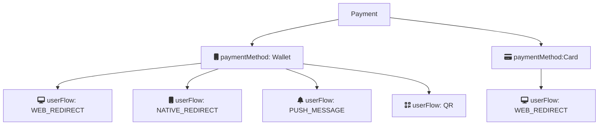

# Create payment

The first step in the payment flow is creating a payment by calling
[`POST:/payments`](https://developer.vippsmobilepay.com/api/epayment#tag/CreatePayments)
endpoint. This endpoint supports card and wallet as payment methods and different user flows for each.

`paymentMethod.type` in the request determines the type of payment. Allowed
values are `CARD` and `WALLET`.

**Please note:** Card payment (`CARD`) is not available in test environment.

## User flow alternatives

The `userFlow` parameter specifies how the API should handle the payment,
and how the user experience will be.

| `userFlow` | Description |
| `WEB_REDIRECT` | The normal flow for browser-based payment flows. |
| `NATIVE_REDIRECT` | For automatic app-switch between the merchant's native app and the Vipps app. |
| `PUSH_MESSAGE` | For payments initiated on a different device than the user's phone. Similar to [`skipLandingPage`](https://developer.vippsmobilepay.com/docs/vipps-developers/common-topics/vipps-landing-page#skip-landing-page) in the [eCom API](https://developer.vippsmobilepay.com/docs/APIs/ecom-api) |
| `QR`| Returns a QR code that can be scanned to complete the payment. |

### WEB_REDIRECT

The default flow for:

- Wallet payments
  - Open the
    [Vipps landing page](https://developer.vippsmobilepay.com/docs/vipps-developers/common-topics/vipps-landing-page)
    on desktop, and automatic redirect to Vipps on mobile devices.
- Card payments
  - Open the Vipps card entry page on both desktop and mobile. More information at
    [Card payments](https://developer.vippsmobilepay.com/docs/APIs/checkout-api/vipps-checkout-api-faq#card-payments).

### NATIVE_REDIRECT

Applicable only for `WALLET` payments.
The given `redirectUrl` will automatically open the Vipps app on mobile devices (app-switch).

### PUSH_MESSAGE

Applicable only for `WALLET` payments. This will skip the
[Vipps landing page](https://developer.vippsmobilepay.com/docs/vipps-developers/common-topics/vipps-landing-page)
and is only allowed if user is not starting the payment from own device
(e.g., from a Point Of Sale device, vending machines and similar).

If `userFlow` is `PUSH_MESSAGE`, a valid value for `customer.phoneNumber` is required.

### QR

Applicable only for `WALLET` payments. For customer-facing screens where payment
can be initiated with
[Vipps One Time Payment QR](https://developer.vippsmobilepay.com/docs/APIs/qr-api/vipps-qr-one-time-payment-api-howitworks).
