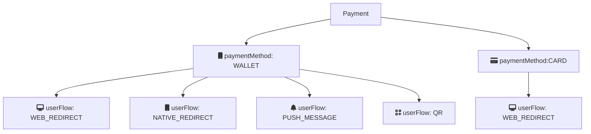

# Create payment

The first step in the payment flow is to create a payment with
[`POST:/epayment/v1/payments`](https://developer.vippsmobilepay.com/api/epayment#tag/CreatePayments).
This endpoint supports both *wallet* (i.e., the Vipps MobilePay app) and
freestanding card payments, when card details are entered.
Each payment type offers separate user flows.

The `paymentMethod.type` in the request determines the type of payment:

* `WALLET`: The user pays through the Vipps MobilePay app. This includes delegated Secure Customer Authentication (SCA),
   where the login to the app eliminates the need for a separate SCA step.
  `WALLET` payments include retry functionality such that, if the user attempts to pay
  with a declined card, they can retry with a different card for the same payment process.
* `CARD`: The user pays with a card. They enter the card details into a form and then complete the 3D Secure step-up
  for SCA. See
  [Card payments](https://developer.vippsmobilepay.com/docs/faqs/users-and-payments-faq/#card-payments)
  for more information.

  **Please note:** Card payment (`CARD`) is not available in the test environment.

## User flow alternatives

The `userFlow` parameter specifies how the API should handle the payment
and how the user experience will be.

| `userFlow`        | Description                                          |
| ----------------- | ---------------------------------------------------- |
| `WEB_REDIRECT`    | The normal flow for browser-based payment flows. If on a mobile device, the Vipps MobilePay app will open. Otherwise, the [landing page](https://developer.vippsmobilepay.com/docs/common-topics/landing-page/) will open.    |
| `NATIVE_REDIRECT` | Automatic app-switch between the merchant's native app and the Vipps MobilePay app. |
| `PUSH_MESSAGE`    | For payments initiated on a device other than the user's phone, the user gets a push message that opens the payment in the app. This is similar to [`skipLandingPage`](https://developer.vippsmobilepay.com/docs/common-topics/landing-page#skip-landing-page). |
| `QR`              | Returns a QR code that can be scanned to complete the payment. |

### WEB_REDIRECT

This is the default flow for wallet and card payments.

* Wallet flow:
  When the user is on a mobile device, redirect them to the Vipps MobilePay app. From the desktop, open the
  [landing page](https://developer.vippsmobilepay.com/docs/common-topics/landing-page).

* Card flow:
  Whether the user is on a desktop or mobile device, open the card entry page. See
  [Card payments](https://developer.vippsmobilepay.com/docs/faqs/users-and-payments-faq/#card-payments) for more information.

### NATIVE_REDIRECT

Applicable only for `WALLET` payments.

The `redirectUrl` will automatically open the Vipps MobilePay app on mobile devices.

### PUSH_MESSAGE

Applicable only for `WALLET` payments.

For payments initiated on a device other than the user's phone, the user gets a push message that opens the payment in the app. This is similar to [`skipLandingPage`](https://developer.vippsmobilepay.com/docs/common-topics/landing-page#skip-landing-page).

If `userFlow` is `PUSH_MESSAGE`, a valid value for `customer.phoneNumber` is required, since there is no
way for the customer to enter the phone number manually.

### QR

Applicable only for `WALLET` payments.

This user flow is for customer-facing screens where payments can be initiated with the
[One-time payment QR](https://developer.vippsmobilepay.com/docs/APIs/qr-api/vipps-qr-api/#one-time-payment-qr-codes).
