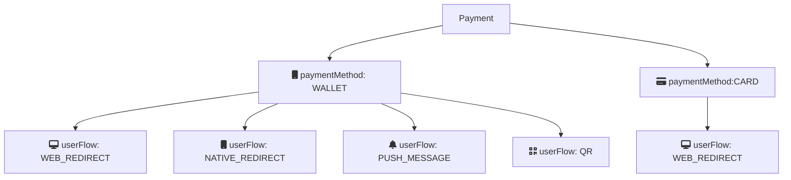

# Create payment

The first step in the payment flow is to create a payment with
[`POST:/epayment/v1/payments`](https://developer.vippsmobilepay.com/api/epayment#tag/CreatePayments).
This endpoint supports both wallet (the app) and freestanding card payments (by entering the card details);
as well as providing different user flows for each payment type.

The `paymentMethod.type` in the request determines the type of payment:
* `WALLET`: With the Vipps MobilePay app. This includes delegated SCA (secure customer authentication),
   where the login to the app eliminates the need for a separate SCA step.
  `WALLET` payments also include retry functionality; If the user attempts to pay
  with a card that is declined, the user can retry with a different card,
  while still in the same payment process.
* `CARD`: The user enters the card details in a form, followed by a 3D Secure step-up
  for SCA. See
  [Card payments](https://developer.vippsmobilepay.com/docs/vipps-developers/faqs/users-and-payments-faq/#card-payments).

**Please note:** Card payment (`CARD`) is not available in test environment.

## User flow alternatives

The `userFlow` parameter specifies how the API should handle the payment,
and how the user experience will be.

| `userFlow`        | Description                                          |
| ----------------- | ---------------------------------------------------- |
| `WEB_REDIRECT`    | The normal flow for browser-based payment flows. If on a mobile device, the Vipps MobilePay app will open. Otherwise, the [Vipps landing page](https://developer.vippsmobilepay.com/docs/vipps-developers/common-topics/vipps-landing-page/) will open.    |
| `NATIVE_REDIRECT` | For automatic app-switch between the merchant's native app and the Vipps MobilePay app. |
| `PUSH_MESSAGE`    | For payments initiated on a different device than the user's phone. The user gets a push message that opens the payment in the app.Similar to [`skipLandingPage`](https://developer.vippsmobilepay.com/docs/vipps-developers/common-topics/vipps-landing-page#skip-landing-page) in the [eCom API](https://developer.vippsmobilepay.com/docs/APIs/ecom-api) |
| `QR`              | Returns a QR code that can be scanned to complete the payment. |

### WEB_REDIRECT

The default flow for:

* Wallet payments:
  Opens the
  [Vipps landing page](https://developer.vippsmobilepay.com/docs/vipps-developers/common-topics/vipps-landing-page)
  when the user is on another device than a phone (such as a /laptop computer), and automatically redirects to the
  app when the user is using a phone.
* Card payments:
  Opens the card entry page on both desktop and mobile. More information at
  [Card payments](https://developer.vippsmobilepay.com/docs/vipps-developers/faqs/users-and-payments-faq/#card-payments).

### NATIVE_REDIRECT

Applicable only for `WALLET` payments.

The `redirectUrl` will automatically open the Vipps app on mobile devices, using app-switch.

### PUSH_MESSAGE

Applicable only for `WALLET` payments. 

This will skip the
[Vipps landing page](https://developer.vippsmobilepay.com/docs/vipps-developers/common-topics/vipps-landing-page)
and is only allowed if user is not starting the payment from own device
(e.g., from a Point Of Sale device, vending machines and similar).

If `userFlow` is `PUSH_MESSAGE`, a valid value for `customer.phoneNumber` is required, since there is no
way for the customer to enter the phone number manually.

### QR

Applicable only for `WALLET` payments. 

For customer-facing screens where payments can be initiated with
[Vipps One Time Payment QR](https://developer.vippsmobilepay.com/docs/APIs/qr-api/vipps-qr-one-time-payment-api-howitworks).
